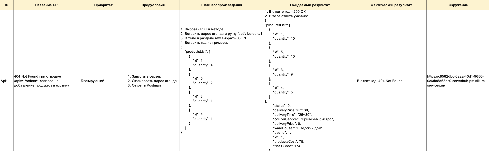
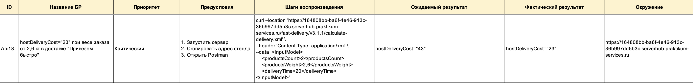

    README доступен на русском языке.
    English version available upon request.

# Тестирование API приложения "Яндекс.Лавка"

## О проекте

"Яндекс.Лавка" — 

**Цель тестирования:**

## Структура тестовой документации
- **Документация** 
    + Файл: `yandex-lavka-API.xlsx`
- **Скриншоты**
    + Папка: Screenshots/

## Область тестирования

## Используемые инструменты

## Что было сделано
- Проведен тест-анализ (декомпозиция требований, работа с серыми зонами)
- Разработаны чек-листы
- Выполнено функциональное тестирование
- Составлены баг-репорты

## Результаты

## Примеры найденных дефектов
### Баг №1 — 
- **Описание:** 
- **Ожидаемый результат:** 
- **Фактический результат:** 

### Баг №2 — 
- **Описание:** 
- **Ожидаемый результат:** 
- **Фактический результат:** 

## Вывод
