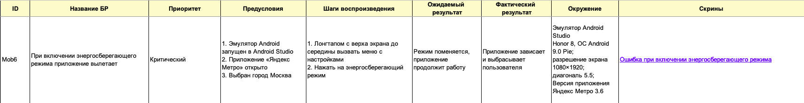
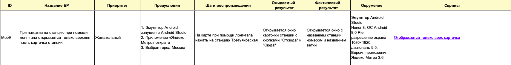

    README доступен на русском языке.
    English version available upon request.

# Тестирование mobile-приложения "Яндекс.Метро"

## О проекте

"Яндекс.Метро" — мобильное приложение для навигации в метрополитене.  
Сервис предоставляет интерактивную схему метро, позволяет строить маршруты между станциями и рассчитывает предполагаемое время в пути.  

Дополнительно приложение отображает актуальные уведомления об изменениях в работе станций и графике движения.

**Цель тестирования:**
Проверка корректности построения маршрутов, расчёта времени в пути и отображения пользовательского интерфейса.

## Структура тестовой документации
- **Документация** 
    + Файл: `Яндекc.Метро.xlsx`
- **Скринкасты** 
    + Папка: Screencasts/
- **Скриншоты**
    + Папка: Screenshots/

## Область тестирования
**Функциональное тестирование:**
- Построение маршрута и обновление времени
- История поиска и карточка станции
- Работа приложения при смене ориентации и отсутствии интернет-соединения

**Регрессионное тестирование:**
- Установка и обновление приложения
- Работа с сетью, прерываниями и правами доступа
- Геолокация и системные датчики
- UI/UX: жесты, адаптивность, темы
- Производительность и использование памяти
- Кнопка «Обратная связь»

## Используемые инструменты
- Google Sheets — тестовая документация
- Google Docs — отчет о проделанной работе
- Figma — анализ макетов
- Android Studio (эмулятор) — тестирование мобильного приложения

## Что было сделано
- Проведен тест-анализ (декомпозиция требований, работа с серыми зонами)
- Разработаны чек-листы
- Выполнено функциональное и регрессионное тестирование
- Составлены баг-репорты
- Оформлен отчет о тестировании

## Результаты
Из 75 проверок успешно прошло 64 теста, не прошло 11 тестов

Выявлено 11 дефектов, распределённых по приоритетам:
- **Критические (4)** — аварийное завершение приложения при смене ориентации, переключении темы и включении энергосбережения; некорректная работа кнопки «Обратная связь».
- **Средние (3)** — ошибки обновления временных интервалов, некорректный порядок отображения истории, смещение карты при выборе станции.
- **Низкие (3)** — проблемы геолокации, автоматической смены темы и отображения карточки станции.
- **Незначительные (1)** — отсутствие уведомления при потере интернет-соединения.

Большинство критических дефектов связано с обработкой системных событий и изменением состояния приложения.

## Примеры найденных дефектов
### Баг №1 — Некорректная работа при включении энергосберегающего режима
- **Описание:** при включении энергосберегающего режима приложение аварийно завершает работу
- **Ожидаемый результат:** приложение продолжает корректную работу
- **Фактический результат:** приложение зависает и выбрасывает пользователя

### Баг №2 — Некорректное отображение карточки станции при лонг-тапе на станцию
- **Описание:** при нажатии на станцию при помощи лонг-тапа открывается только верхняя часть карточки станции
- **Ожидаемый результат:** открывается окно карточки станции с кнопками "Отсюда" и "Сюда"
- **Фактический результат:** открывается окно с названием станции, номером и названием ветки

## Вывод
В ходе тестирования выявлены критические дефекты, связанные с обработкой системных событий и изменением состояния приложения.  
Проект позволил отработать тестирование пользовательских и системных сценариев, а также анализ стабильности мобильного приложения в различных условиях эксплуатации.
