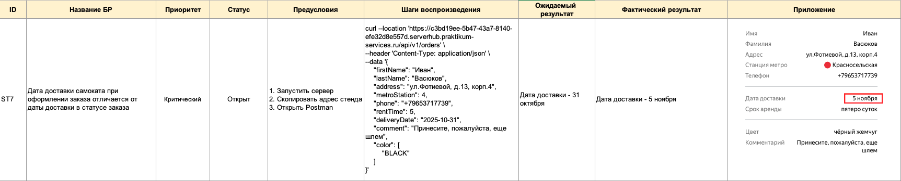
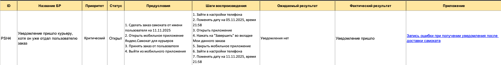
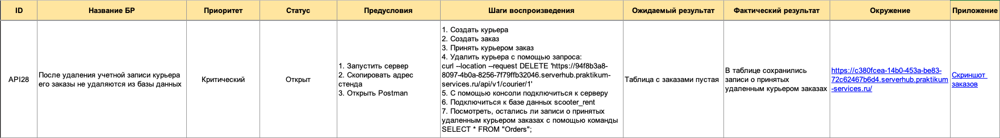

    README доступен на русском языке.
    English version available upon request.

# Тестирование приложения "Яндекс.Самокат"

## О проекте
- "Яндекс.Самокат" - это сервис, который позволяет арендовать электрический самокат на несколько дней.

**Цель тестирования:**

## Структура тестовой документации
Проект разделен  на три части:
- **Часть 1 — Веб-версия приложения** 
    + Файл: `yandex-samokat (web version).xlsx`
- **Часть 2 — Мобильная версия приложения** 
    + Файл: `yandex-samokat (mobile version).xlsx`
- **Часть 3 — API приложения** 
    + Файл: `yandex-samokat (API).xlsx`
- **Скриншоты**
    + Папка: Screenshots/

## Область тестирования
**Часть 1** - web-версия
- Экран "Статус заказа"
- Валидация полей экрана "Сделать заказ"
- Тестирование всей функциональности

**Часть 2** - mobile-версия 
- Нотификация 
- Поведение при отсутствии интернета
- Проверкаверстки по макетам к этой функциональности

**Часть 3** API
- URL для курьеров
- URL для получения данных о заказе по его номеру отслеживания

## Используемые инструменты
- DevTools (Chrome, Яндекс.Браузер) - анализ запросов и поведения UI
- Кроссбраузерное тестирование: Google Chrome, Яндекс.Браузер
- Android Studio (эмулятор) — тестирование мобильного приложения
- Postman — тестирование API 
- Apidoc — анализ требований проекта
- Google Docs — отчет о проделанной работе
- Google Sheets - тестовая документация
- Notion - анализ требований проекта
- Figma - анализ макетов

## Что было сделано
- Проведен тест-анализ (декомпозиция требований, работа с серыми зонами)
- Применены техники тест-дизайна: 
    + классы эквивалентности
    + граничные значения
- Разработаны тест-кейсы и чек-листы
- Выполнено функциональное тестирование
- Составлены баг-репорты

## Результаты

Проект включал тестирование web-версии, мобильного приложения и API.

### Web-версия
Выявлены дефекты в логике обновления статусов заказа, синхронизации данных между этапами оформления и отображением статуса, а также валидации пользовательского ввода.  
Обнаружены блокирующие ошибки кроссбраузерной совместимости и критические нарушения обязательности ключевых полей формы (адрес, дата доставки).

### Mobile-версия
Зафиксированы дефекты обработки push-уведомлений, переходов из уведомления в приложение и работы в условиях нестабильного соединения.  
Критические ошибки связаны с некорректной синхронизацией статусов заказа и обработкой системных событий.

### API
При тестировании API выявлены ошибки серверной проверки данных при создании учетных записей.
В ряде случаев сервер возвращает некорректные статусы и принимает недопустимые значения, что может приводить к созданию некорректных данных.

---

**Основные зоны риска:**  
Основные проблемы связаны с проверкой вводимых данных, согласованностью работы разных частей системы и обработкой системных событий.

## Примеры найденных дефектов
### Баг №1 — Некорректное отображение даты доставки
- **Описание:** Дата доставки самоката при оформлении заказа отличается от даты доставки в статусе заказа
- **Ожидаемый результат:** дата при оформлении заказа совпадает с датой доставки в статусе заказа
- **Фактический результат:** Даты различаются

### Баг №2 — Некорректная работа уведомления в приложении курьера
- **Описание:** Уведомление пришло курьеру, хотя он уже отдал пользователю заказ
- **Ожидаемый результат:** Уведомления нет
- **Фактический результат:** Уведомление пришло

### Баг №3 — Некорректое удаление учетной записи курьера
- **Описание:** После удаления учетной записи курьера его заказы не удаляются из базы данных
- **Ожидаемый результат:** Учетная запись курьера удалена
- **Фактический результат:** В базе данных сохранились записи о принятых удаленным курьером заказах 

## Вывод 
